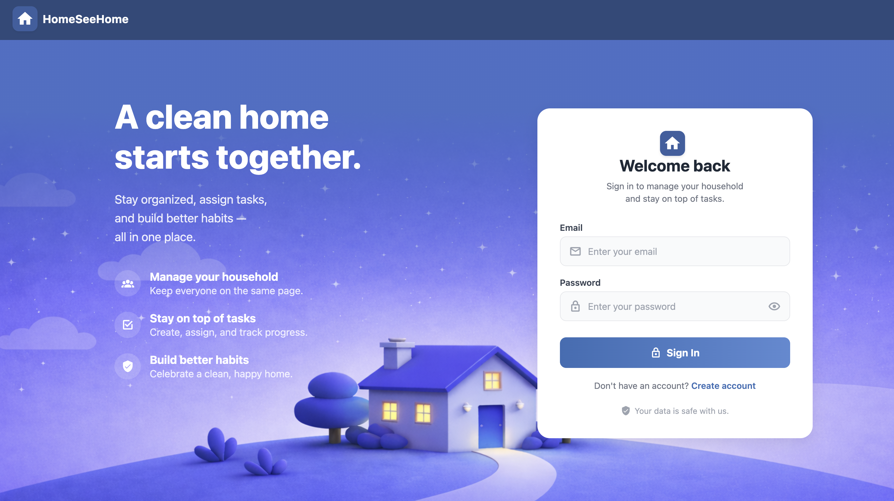
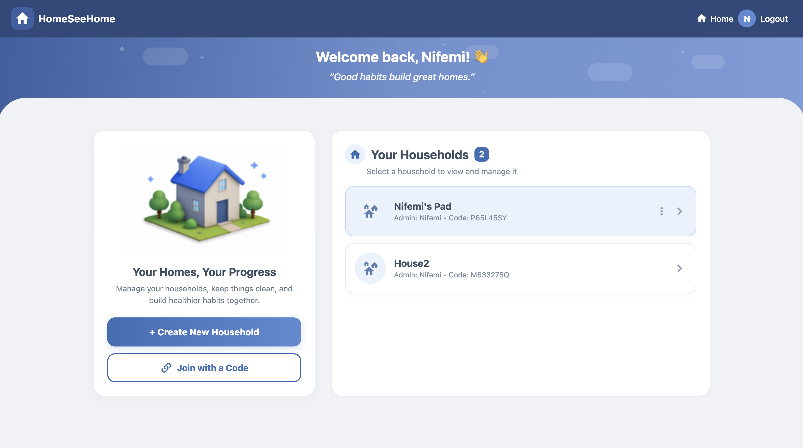
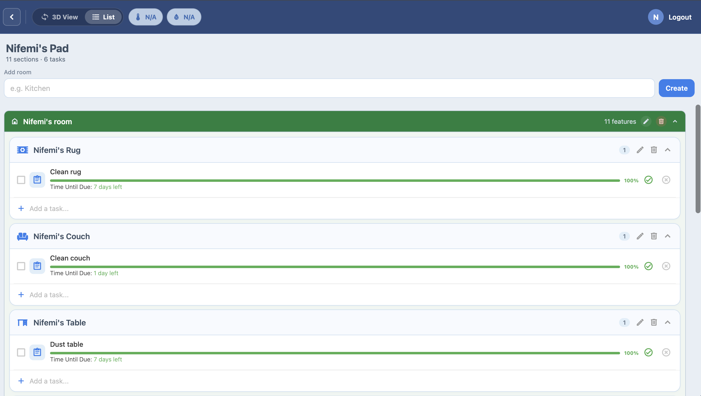
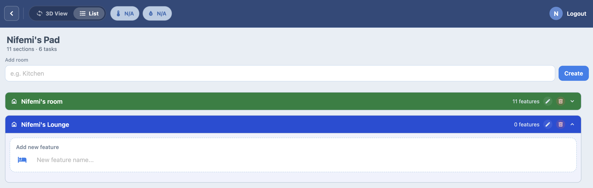
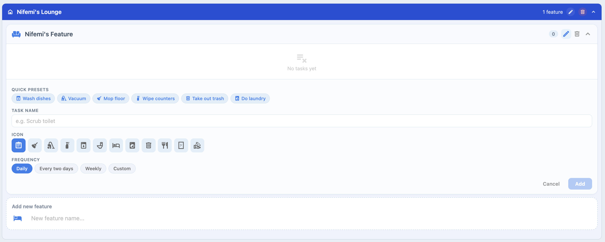
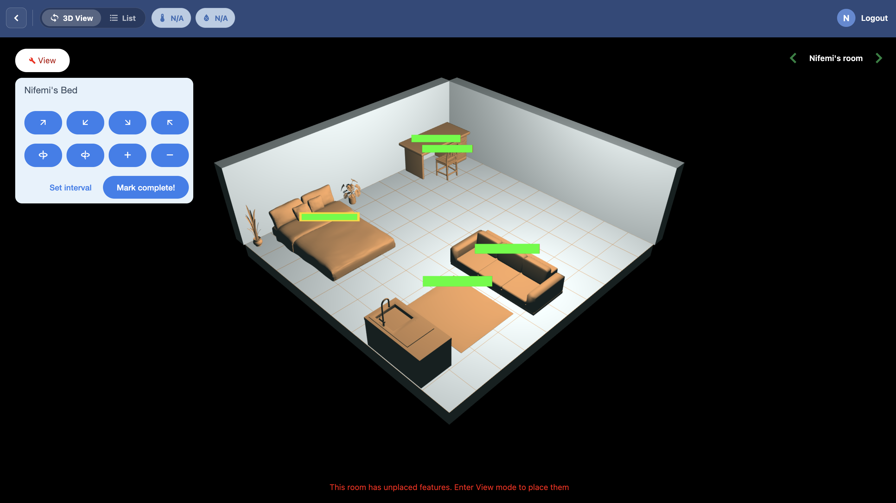
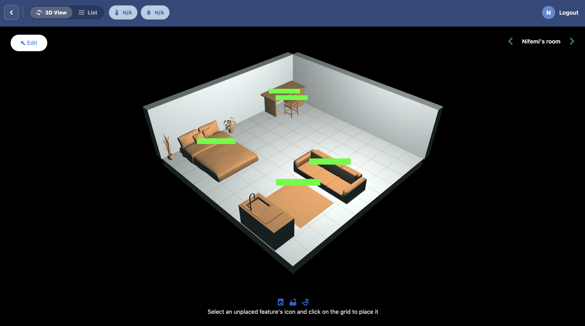
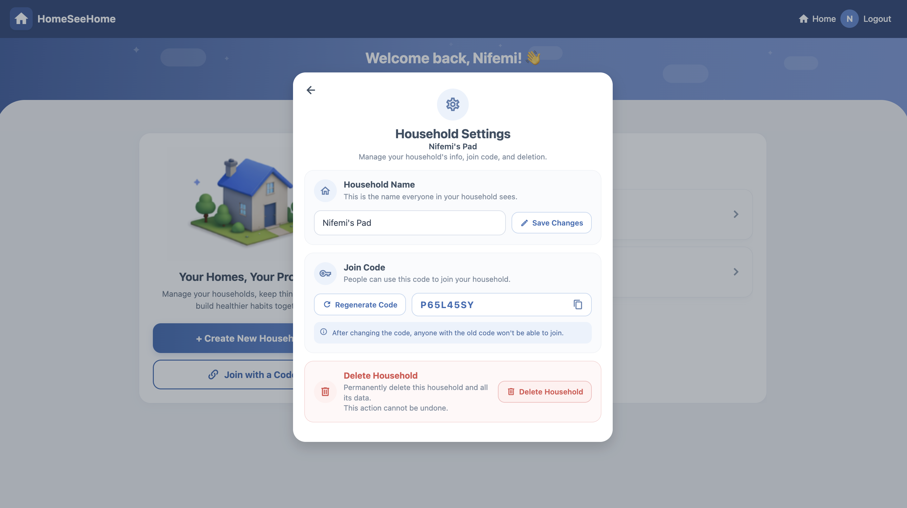
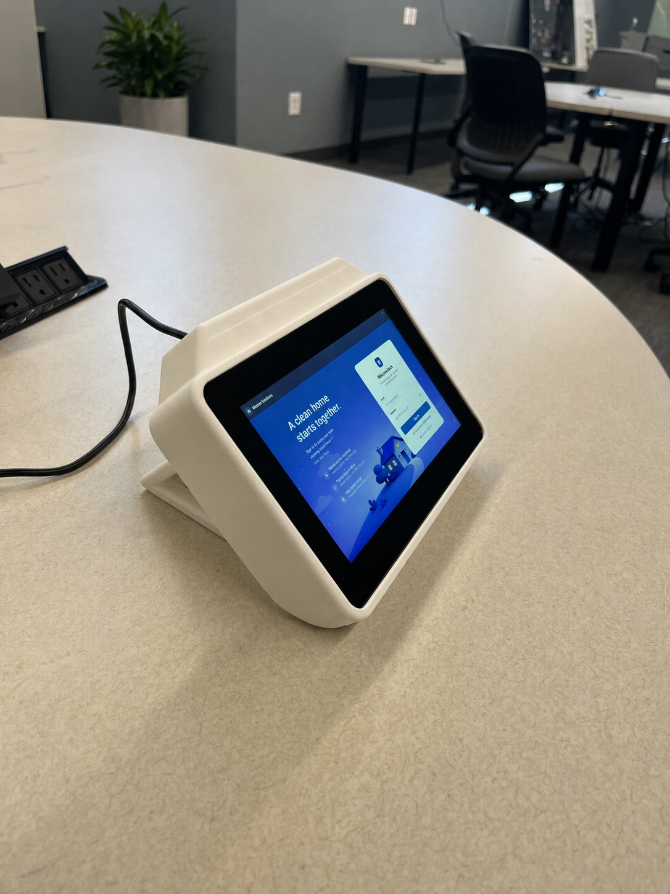

# Home See Home

Portfolio mirror of **Home See Home**, an EECS 582 team project focused on household task management across a traditional list interface and an interactive 3D view.

This repository is meant to present the project clearly for review. The original development repo is here: [nifemi-l/EECS-582-Project](https://github.com/nifemi-l/EECS-582-Project)

## Team

Jack Bauer, Blake Carlson, Nifemi Lawal, Logan Smith, Delroy Wright

## Project Summary

Home See Home was built as a shared household platform where users can create or join households, organize recurring chores, and manage household features in either a list-based workflow or a 3D graphical view.

The project combined software and hardware work:

- an Expo / React Native client
- a Flask + PostgreSQL backend
- a 3D household view rendered with WebGL
- a physical touchscreen-style hardware build used as part of the project presentation

## What Was Built

- account registration and login
- household creation, join codes, membership management, and admin controls
- room, feature, and recurring task management
- list view with task grouping, presets, and completion tracking
- 3D view with feature placement, rotation, scaling, and room-based navigation
- environmental data display for temperature and humidity

## Stack

- **Frontend:** Expo, React Native, Expo Router, React Native Paper
- **Backend:** Python, Flask, PostgreSQL
- **Graphics:** Expo GL / WebGL
- **Auth & data:** JWT, `psycopg2`, `passlib`, `bcrypt`

## Screenshots

### Login

### Home

### List View

### Task Presets

### Feature Edit Options

### 3D View

### Household Settings

## Hardware

The project also included a physical hardware build for the household display interface.

